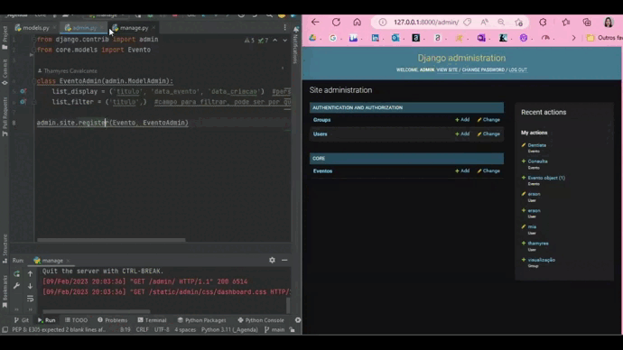
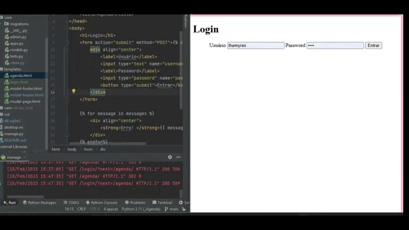
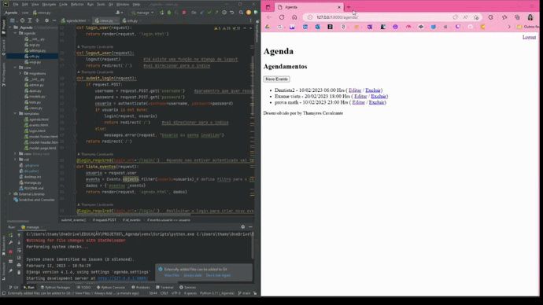

<h1 align="center"> Agenda com Django </h1>

 

---

Projeto de Desenvolvido Web com Django e Pyhton. 

 

  <a href="#-tecnologias">Tecnologias</a>&nbsp;&nbsp;&nbsp;|&nbsp;&nbsp;&nbsp; 
  <a href="#-projeto">Projeto</a>&nbsp;&nbsp;&nbsp;|&nbsp;&nbsp;&nbsp; 
  <a href="#-gif">Gif</a>&nbsp;&nbsp;&nbsp;&nbsp;&nbsp;&nbsp; 

 

  
Introdução ao mundo Django, criação de uma agenda com python e django. 

  
- Introdução aos conceitos e ambiente do Django 
- Estrutura basica do Django
- Criação de tabelas com models
- Criação de pagina de listagem
- Autenticação e inserção de dados
- Alteração e exclusão de dados
- Filtros, tipos de response e configurações

 

## 🚀 Tecnologias

Esse projeto foi desenvolvido com as seguintes tecnologias:
- Django
- Python
- Git e Github

 

## 💻 Projeto

Para a uso desse projeto utilizar o venv.

 

## 📸 Gif

Criação de tabelas com models

</img>

Criação de pagina de listagem e Autenticação
</img>

Pagina de alteração e exclusão de evento
</img>

 

---

Feito com ♥ by Thamyres Cavalcante.
